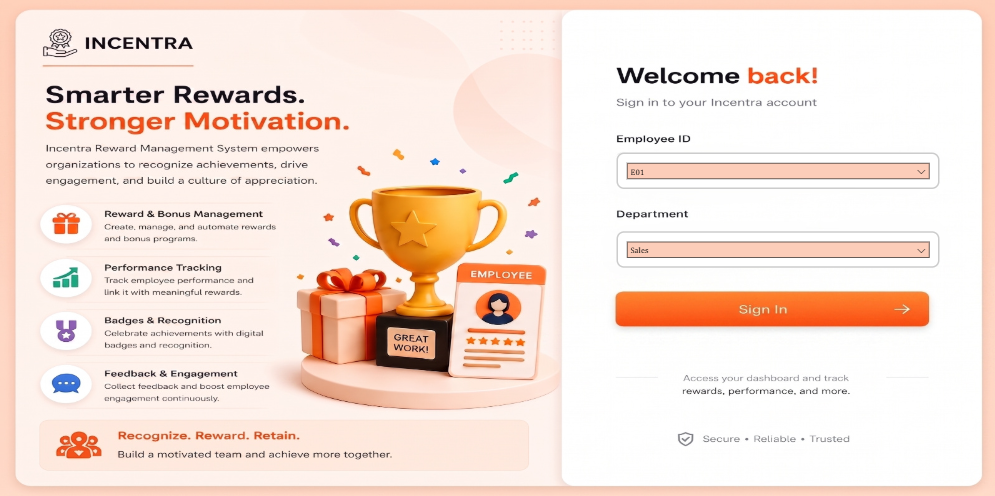
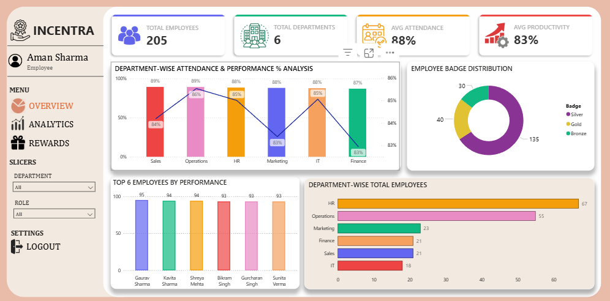
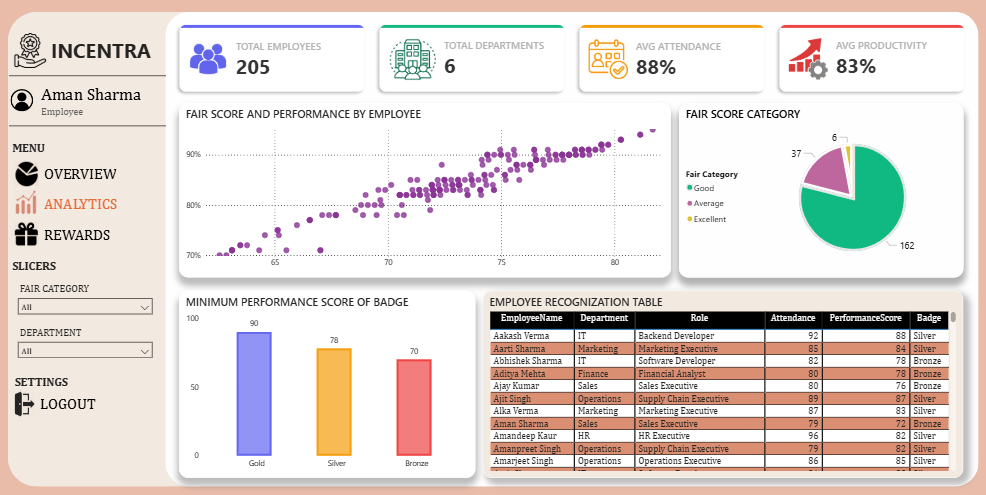
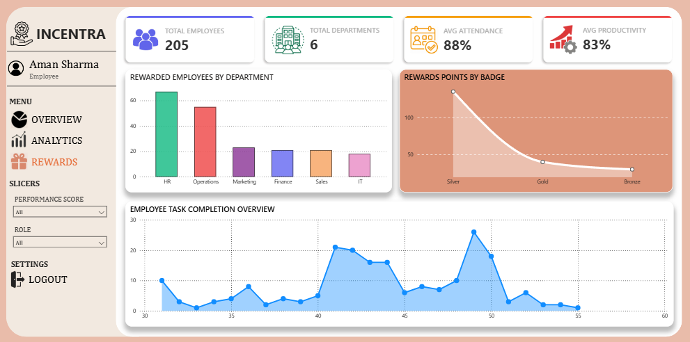

# INCENTRA – Employee Reward Management System

INCENTRA is a Power BI dashboard project built to help organizations track employee performance, attendance, and fair-score based rewards. It converts raw HR data into an interactive, multi-page reporting experience covering overview metrics, department-level analytics, and a dedicated rewards/badge tracking view.

> **Note:** This is a Power BI (.pbix) analytics project, not an AI/ML application. The "login page" is a static UI mockup — Employee ID and Department slicers are used in place of real authentication fields, and the artwork is AI-generated for visual polish only. No user data is stored or authenticated.

🔗 **Live Dashboard:** [View on Power BI](https://app.powerbi.com/view?r=eyJrIjoiNGI5NjA5MjUtMzEwNC00YjBlLTk4YzEtNmViYWNiOGNmN2YzIiwidCI6ImUxNGU3M2ViLTUyNTEtNDM4OC04ZDY3LThmOWYyZTJkNWE0NiIsImMiOjEwfQ%3D%3D)

---

## 📊 Project Overview

- **Employees tracked:** 205
- **Departments:** 6 (Sales, Operations, HR, Marketing, IT, Finance)
- **Core metrics:** Attendance %, Productivity %, Performance Score, Fair Score, Badge Tier (Gold / Silver / Bronze)
- **Data source:** `employee_data.csv` — EmployeeID, Name, Gender, Department, Role, Attendance, Tasks Completed, Performance Score, Feedback Score, Productivity Score

---

## 🖥️ Dashboard Pages

### 1. Landing / "Sign In" Page (UI Mockup)
A styled entry screen introducing INCENTRA's value proposition — reward & bonus management, performance tracking, badges & recognition, and feedback/engagement — with Employee ID and Department slicers standing in for login fields.

### 2. Overview Page
- KPI cards: Total Employees, Total Departments, Avg Attendance, Avg Productivity
- Department-wise Attendance & Performance % analysis (combo chart)
- Employee Badge Distribution (donut chart)
- Top 6 Employees by Performance
- Department-wise Total Employees (bar chart)

### 3. Analytics Page
- Fair Score vs Performance scatter plot across all employees
- Fair Score Category breakdown (Good / Average / Excellent)
- Minimum Performance Score required per Badge tier
- Full Employee Recognition Table with Attendance, Performance Score, and Badge, filterable by Fair Category and Department

### 4. Rewards Page
- Rewarded Employees by Department
- Reward Points by Badge (Silver > Gold > Bronze curve)
- Employee Task Completion Overview (trend across performance range)
- Filterable by Performance Score and Role

---

## 🧮 Key Logic

- **Fair Score / Fair Category:** Employees are grouped into Good, Average, and Excellent buckets based on a blended attendance + performance calculation, surfaced through the scatter plot and pie chart on the Analytics page.
- **Badge Tiers:** Gold, Silver, and Bronze badges are assigned based on minimum performance score thresholds (90 / 78 / 70), visualized in the "Minimum Performance Score of Badge" chart.
- **Reward Points:** Points scale inversely with badge rank, shown in the Rewards page trend chart.

---

## 🛠️ Tech Stack

- **Power BI Desktop** – data modeling, DAX measures, report design
- **CSV** – source employee dataset
- **Power Query** – data cleaning and transformation
- **DAX** – KPI and category calculations (Fair Score, Badge assignment, averages)

---

## 📁 Repository Structure

```
INCENTRA-Employee-Reward-Management-System/
│
├── data/
│   └── employee_data.csv
│
├── screenshots/
│   ├── loginpage.png
│   ├── overviewpage.png
│   ├── analyticspage.png
│   └── rewardpage.png
│
└── README.md
```

> The original `.pbix` file exceeds GitHub's upload limits and isn't included in this repo. Screenshots are provided for a quick preview, and the fully interactive dashboard is available via the **Live Dashboard** link above — no Power BI installation needed.

---

## 📸 Preview

| Sign In | Overview |
|---|---|
|  |  |

| Analytics | Rewards |
|---|---|
|  |  |

---

## 🚀 Future Improvements

- Add a real authentication layer if deployed as a web app (e.g., via Power BI Embedded)
- Automate Fair Score/Badge calculation with a scheduled data refresh
- Add year-over-year trend comparisons once historical data is available

